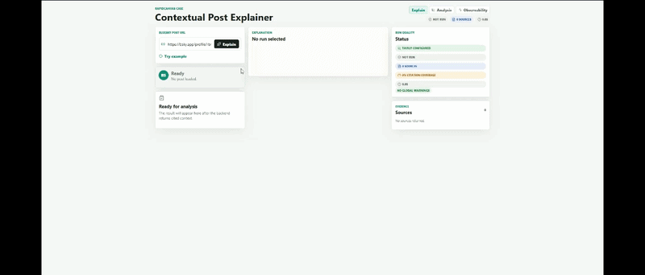

# Contextual Post Explainer

An AI agent that explains Bluesky social media posts by searching for relevant public context, ranking evidence, and returning 3–5 cited explanatory bullets.

Built as a technical exercise for RapidCanvas. The system takes a public Bluesky post URL, decomposes it into search queries, retrieves and reads real web pages, ranks sources by semantic relevance, and generates a structured explanation with verifiable citations — refusing to produce bullets when the evidence cannot safely support them.

---

## Table of Contents

- [What It Does](#what-it-does)
- [Architecture Overview](#architecture-overview)
- [Key Design Decisions](#key-design-decisions)
- [Project Structure](#project-structure)
- [Requirements](#requirements)
- [Quickstart](#quickstart)
  - [Backend with Docker](#backend-with-docker)
  - [Without Docker](#without-docker)
- [Configuration](#configuration)
- [Running the Evaluation Harness](#running-the-evaluation-harness)
- [API Reference](#api-reference)
- [Search Providers](#search-providers)
- [Multi-Provider Comparison](#multi-provider-comparison)
- [Image Understanding](#image-understanding)
- [Limitations](#limitations)
- [What I Would Do With More Time](#what-i-would-do-with-more-time)

---



## What It Does

Paste a Bluesky post URL into the interface. The agent:

1. Fetches the post and its thread context via the public AT Protocol API (no authentication required).
2. Optionally analyzes any images with GPT vision (OCR + visual description).
3. Decomposes the post into 2–4 targeted search queries using an LLM.
4. Searches the web through a configured provider (Brave, Tavily, or both in parallel).
5. Downloads and reads the actual content of each result page — not just the search snippet.
6. Ranks all evidence using OpenAI embeddings and cosine similarity.
7. Generates 3–5 cited explanatory bullets using OpenAI structured outputs.
8. Validates every citation structurally and semantically before returning a response.

If the evidence cannot safely support a full explanation, the system returns an empty `explanation` array with warnings rather than producing unsupported claims.

**Example output for a post about the "Ralph Wiggum technique" for AI coding agents:**

> - The "Ralph Wiggum technique" is a bash-loop approach for running AI coding agents iteratively until tasks complete, named after The Simpsons character for its trial-and-error style. `[source 1]`
> - It was coined by Geoffrey Huntley in mid-2025 and gained traction for its simplicity over elaborate agentic frameworks. `[source 1, 2]`
> - The name spawned derivatives including the $RALPH Solana token. `[source 3]`

---

## Architecture Overview

```
React UI  (Vite + TypeScript + custom CSS)
    │
    │  POST /api/explain  (SSE streaming available at /api/explain/stream)
    ▼
FastAPI  (Python 3.11 + Uvicorn)
    │
    ├── LiveExplanationService
    │       └── LiveExplanationFlow  (LangGraph StateGraph)
    │             ├── validate_live_config
    │             ├── parse_post_url
    │             ├── fetch_bluesky_post_thread   ← AT Protocol, no auth
    │             ├── analyze_images_optional      ← multimodal image analysis step (if OPENAI_VISION_MODEL is set)
    │             ├── decompose_queries            ← LLM → 2–4 queries
    │             ├── search_web_context           ← Brave / Tavily / Composite
    │             ├── fetch_source_pages           ← reads actual page content
    │             ├── rank_evidence                ← embeddings + cosine similarity
    │             ├── generate_explanation         ← structured output JSON
    │             ├── validate_citations           ← structural + semantic guard
    │             ├── repair_once_if_needed        ← one LLM repair pass for citation compatibility
    │             └── finalize_response
    │
    ├── EvalExplanationService
    │       └── EvalExplanationFlow  (LangGraph StateGraph)
    │             ├── load_fixture_post            ← no live Bluesky calls
    │             ├── load_fixture_evidence        ← no live search calls
    │             ├── rank_evidence                ← same ranker as live
    │             ├── generate_explanation         ← same generator as live
    │             ├── validate_citations
    │             ├── repair_once_if_needed
    │             ├── judge_groundedness           ← LLM-as-judge per bullet
    │             └── score_case                   ← 5 metrics
    │
    └── Analysis API  (GET /api/analysis)
            └── aggregates run artifacts for provider/model comparison
```

**Backend layers:**

| Layer | Responsibility |
|---|---|
| `api/` | FastAPI routes, HTTP error mapping, SSE streaming |
| `application/` | Service orchestration, flow wiring, report generation |
| `graphs/` | LangGraph StateGraphs and node implementations |
| `domain/` | Models, policies, citation validation, deduplication |
| `ports/` | Internal Protocol interfaces for all external dependencies |
| `adapters/` | Bluesky, Brave, Tavily, Composite, OpenAI, HTTP, eval fixtures |
| `observability/` | Structured logging (structlog), OpenTelemetry, run artifacts, secret redaction |
| `eval/` | Eval runner, 5-metric scoring, groundedness judge |

---

## Key Design Decisions

### Platform: Bluesky with a platform-agnostic interface

Bluesky was chosen because the assignment PDF uses it as the reference platform, its public AT Protocol API requires no authentication to read posts, and X/Twitter and Reddit restrict API access significantly.

The core agent is platform-agnostic: it receives a normalized `PostData` object from a `PostFetcher` Protocol interface. Adding support for Reddit, blogs, news articles, or RSS feeds requires only a new adapter — the pipeline does not change.

### RAG without a vector database

The pipeline is a retrieval-augmented generation pattern, but does not use a vector store. Evidence is retrieved fresh per request via web search, page content is read and ranked in memory with NumPy cosine similarity, and nothing is persisted between requests. This keeps the system stateless, reproducible, and dependency-free beyond the OpenAI API.

### Separate live and eval flows — no fallback between them

The live mode (`POST /api/explain`) calls Bluesky and a real search provider. If a search provider is not configured, it returns `search_provider_required` rather than degrading silently.

The eval mode (`make eval`) uses pre-cached post and evidence fixtures and does not call Bluesky, Brave, Tavily, or any web page. The only external dependency during eval is the OpenAI API for generation, embeddings, and the LLM-as-judge. Results are reproducible.

Both modes share the same ranking, generation, and citation validation components.

### Citation contract with no exceptions

Every bullet must cite at least one source. Every cited source ID must exist in the returned sources list. If the evidence cannot support 3–5 bullets, `explanation` returns `[]` — no partial or unsupported bullets.

The `CitationValidator` also checks semantic compatibility between claim types and source types:

- A `confirmed_fact` supported only by social media posts gets a `SOCIAL_ONLY_CONFIRMED_FACT` warning.
- A sensitive factual claim without an official, court, or fact-checking source gets a `SENSITIVE_CLAIM_WITHOUT_STRONG_SOURCE` warning.
- A `public_reaction` bullet without a thread or social source gets a warning.

Bullets that fail these checks are repaired (one LLM retry), then removed if repair fails. If fewer than 3 bullets remain, the system returns `explanation: []` rather than a truncated, unreliable result.

### Source fetching: real page content, not snippets

After search results are returned, the agent downloads and parses the actual HTML of each result page using `trafilatura` and `BeautifulSoup`. Citations point to content the model actually read, not just a search engine summary.

### Embeddings for reranking

OpenAI `text-embedding-3-small` embeddings are computed in memory for the post text and all candidate evidence. Cosine similarity ranks the evidence before it is passed to the generation step. A small boost is applied to sources that appeared in multiple search providers (convergence signal) and sources explicitly linked in the original post.

### Multi-provider search (P2)

Three search modes are supported:
- `brave`: Brave Search only
- `tavily`: Tavily only
- `composite`: both providers in parallel, results merged, deduplicated by canonical URL and content hash

Provider attribution is tracked through the pipeline so run artifacts can report which sources were found by which provider and how many final citations came from evidence independently retrieved by both providers.

### Observability without an external service

Every request receives an `x-trace-id` header. Every live and eval execution generates a run artifact at `backend/runs/{mode}/{run_id}.json` containing inputs, node durations, all retrieved sources, ranking discards, final response, and warnings. API keys and tokens are redacted before persistence. OpenTelemetry spans are emitted per node and can be exported to Jaeger or Grafana Tempo via OTLP if configured.

### LangGraph as the orchestrator

The pipeline uses a `StateGraph` for explicit state, ordered nodes, tracing hooks per node, and clean separation between live and eval flows. Each node is a small, testable async function with a typed input/output. LangGraph was chosen for its auditability, not for multi-agent capability.

---

## Project Structure

```
contextual-post-explainer/
│
├── README.md
├── docker-compose.yml
├── Makefile
├── .env.example                   # copy to .env and fill in keys
│
├── backend/
│   ├── pyproject.toml
│   ├── Dockerfile
│   └── app/
│       ├── main.py                # FastAPI app factory
│       ├── config.py              # pydantic-settings, no silent defaults
│       ├── api/                   # routes, error handlers, dependencies
│       ├── application/           # LiveExplanationService, EvalExplanationService
│       ├── graphs/                # LangGraph live_graph, eval_graph, state
│       ├── domain/                # models, policies, validation, deduplication, errors
│       ├── ports/                 # PostFetcher, SearchProvider, LLMClient, etc.
│       ├── adapters/              # Bluesky, Brave, Tavily, Composite, OpenAI, HTTP
│       ├── observability/         # structlog, OTel, run_recorder, redaction
│       ├── eval/                  # runner, metrics, groundedness judge
│       ├── analysis/              # run artifact aggregation for comparison API
│       └── prompts/               # prompts.toml (versioned, hashed in run artifacts)
│
├── frontend/
│   ├── package.json
│   └── src/
│       ├── features/
│       │   ├── explainer/         # main UI: URL input, post preview, explanation, sources
│       │   ├── observability/     # run history and artifact viewer
│       │   └── analysis/          # provider and model comparison dashboard
│       └── shared/                # API client, SSE client, shared components
│
└── eval/
    ├── dataset.yaml               # 12 test cases
    └── fixtures/
        ├── posts/                 # pre-cached PostData JSON
        └── evidence/              # pre-cached Evidence JSON
```

---

## Requirements

- Docker, if you want to run the backend in a container
- Python 3.11+ with [`uv`](https://docs.astral.sh/uv/)
- Node.js 20+
- `OPENAI_API_KEY`
- For live mode: a search provider key (`TAVILY_API_KEY` or `BRAVE_API_KEY`)

---

## Quickstart

### Backend with Docker

```bash
git clone <repo-url>
cd contextual-post-explainer

cp .env.example .env
# Edit .env and fill in OPENAI_API_KEY and TAVILY_API_KEY (or BRAVE_API_KEY)

docker compose up --build backend
```

This starts only the backend at `http://localhost:8000`. The current `docker-compose.yml` does not include the frontend service.

To use the UI with a Dockerized backend, start the frontend locally in a second terminal:

```bash
cd frontend
npm install
cp .env.example .env.local
npm run dev
```

Open `http://localhost:5173` for the UI.

### Without Docker

**Backend:**

```bash
(cd backend && uv sync)
```

**Frontend:**

```bash
(cd frontend && npm install && cp .env.example .env.local)
```

**Run both:**

```bash
# terminal 1, from the repo root
make backend-run   # starts FastAPI on :8000

# terminal 2, from the repo root
make frontend-run  # starts Vite on :5173
```

---

## Configuration

Copy `.env.example` to `.env` in the repo root and fill in the values.

```env
# Required for all modes
OPENAI_API_KEY=sk-...
OPENAI_GENERATION_MODEL=gpt-5.1
OPENAI_JUDGE_MODEL=gpt-5-mini
OPENAI_EMBEDDING_MODEL=text-embedding-3-small
BACKEND_CORS_ORIGINS=["http://localhost:5173","http://127.0.0.1:5173"]

# Required for live mode (pick one or use composite)
SEARCH_PROVIDER=tavily          # brave | tavily | composite
TAVILY_API_KEY=tvly-...
BRAVE_API_KEY=BSA...            # optional if SEARCH_PROVIDER=tavily

# Optional: enables GPT Vision image analysis
OPENAI_VISION_MODEL=gpt-5.1

# Required for eval mode
EVAL_FIXTURE_DIR=eval/fixtures

# Optional: labels for comparative analysis runs
COMPARISON_GROUP_ID=
COMPARISON_CONFIG_ID=
```

The frontend reads `VITE_API_BASE_URL` from `frontend/.env.local` or `frontend/.env`. Copy `frontend/.env.example` to `frontend/.env.local` for local development. The default value is `http://localhost:8000`.

**Recommended defaults for the POC:**

| Model | Default | Notes |
|---|---|---|
| Generation | `gpt-5.1` | Best reliability on test set (100% completion rate across 23 URLs) |
| Judge | `gpt-5-mini` | Eval groundedness judge |
| Embedding | `text-embedding-3-small` | Larger model tested but showed no product improvement |
| Image analysis | `gpt-5.1` | Runs as a separate pipeline step only when `OPENAI_VISION_MODEL` is set; same model as generation |
| Search | `tavily` | Highest completion reliability; Brave useful in composite mode |

---

## Running the Evaluation Harness

The eval harness requires only `OPENAI_API_KEY`. It does not call Bluesky, Brave, Tavily, or any web page — it uses pre-cached fixtures.

```bash
make eval
```

Results are written to:
- `eval/results/latest.json`
- `eval/results/latest.md`
- `backend/runs/eval/{run_id}.json` (per-case artifact with groundedness detail)

**Test cases (12 total):**

| ID | Type | What it tests |
|---|---|---|
| `tc01_public_launch` | Product announcement | Factual claim with public source |
| `tc02_thread_reply` | Thread reply | Context dependency on parent post |
| `tc03_external_link` | External link | Source fetcher reads linked article |
| `tc04_quote_post` | Quote-post | Context from quoted post |
| `tc05_image_alt` | Image with alt text | Alt text as image evidence |
| `tc06_ambiguous_reference` | Ambiguous phrasing | Evidence narrows interpretation |
| `tc07_factual_claim` | API rate limit claim | Factual verification with primary source |
| `tc08_low_evidence` | Private joke | System returns `[]` instead of inventing |
| `tc09_recent_event` | Public beta | Recent event with indexed context |
| `tc10_multi_reference` | Multiple topics | Separate context for each reference |
| `tc11_groundedness_supported` | P1 groundedness | Bullet-level verification by judge LLM |
| `tc12_image_text_extraction` | Image OCR | Visible text extracted from image context |

**Note:** For many test cases (e.g., `tc08_low_evidence`), the expected and correct outcome is an empty `explanation` array. This demonstrates the system's commitment to its citation contract, refusing to generate claims when evidence is insufficient or unreliable.

**5 metrics:**

| Metric | Description |
|---|---|
| `fact_coverage` | Deterministic lexical coverage using substring and token overlap between expected facts and generated bullets |
| `citation_coverage` | Fraction of bullets with at least one source ID |
| `hallucination_penalty` | Token overlap between `must_not_claim` list and generated bullets |
| `groundedness` | LLM-as-judge verdict per bullet against its cited sources (`supported` / `partially_supported` / `unsupported`) |
| `usefulness` | Composite score (1–5) derived from the four metrics above |

---

## API Reference

### `GET /api/health`

```json
{
  "status": "ok",
  "service": "contextual-post-explainer-api",
  "version": "0.1.0"
}
```

### `GET /api/config/status`

Returns current model and provider configuration, including live/eval readiness flags. `status` is `ready` when live search is fully configured, `degraded` when the backend can start but live mode is missing provider credentials, and `invalid` when required runtime configuration is missing.

### `POST /api/explain`

**Request:**
```json
{
  "url": "https://bsky.app/profile/user.bsky.social/post/3k...",
  "include_debug": false
}
```

**Success response:**
```json
{
  "post": {
    "url": "...",
    "author": { "handle": "user.bsky.social" },
    "text": "...",
    "platform": "bluesky",
    "images": []
  },
  "explanation": [
    { "text": "...", "source_ids": ["s1", "s2"], "claim_label": "confirmed_fact", "confidence": "high", "warnings": [] }
  ],
  "sources": [
    { "id": "s1", "title": "...", "url": "...", "snippet": "...", "source_type": "web", "source_category": "news_outlet", "source_role": "independent_context" }
  ],
  "confidence": "high",
  "warnings": [],
  "execution_time_ms": 8400
}
```

**Error responses:**

| Error code | HTTP | Meaning |
|---|---|---|
| `search_provider_required` | 400 | Live mode configured without a search provider key |
| `unsupported_platform` | 400 | URL is not a recognized Bluesky post URL |
| `post_not_found` | 404 | Post was deleted or URL is incorrect |
| `external_provider_error` | 502 | Bluesky, search provider, or OpenAI returned an error |

When evidence is insufficient, the response returns HTTP 200 with `explanation: []` and descriptive warnings rather than an error status.

### `POST /api/explain/stream`

Same request body as `/api/explain`. Returns a Server-Sent Events stream with `progress` events during processing and a final `result` event with the full response payload. Each progress event includes a `step` label (`Fetching post`, `Searching context`, `Reading sources`, `Ranking evidence`, `Generating explanation`) and a `status` field.

### `GET /api/runs` and `GET /api/runs/{run_id}`

List and retrieve run artifacts persisted to `runs/`.

### `GET /api/analysis`

Aggregates run artifacts and returns provider and model comparison data: average bullet count, source count, warning count, execution time, and URL-level behavior change detection across different configurations.

---

## Search Providers

Set `SEARCH_PROVIDER` in `.env` to one of:

| Value | Description |
|---|---|
| `tavily` | Tavily Search API. Recommended default — highest completion reliability in controlled experiments (100% across 23 test URLs). |
| `brave` | Brave Search API. Faster and sometimes finds strong official sources. Produced 3 no-explanation outcomes on the same 23 URLs; better as a composite input than a standalone default. |
| `composite` | Both providers in parallel. Results are merged and deduplicated by canonical URL, title, and content hash. Tracking query parameters (`utm_*`, `fbclid`, etc.) are stripped before comparison. Provider attribution is recorded in each source for analysis. |

In `composite` mode, run artifacts include:
- `search_results_by_provider` — result count per provider per run
- `ranked_sources_by_provider` — which sources made it through ranking per provider
- `ranked_multi_provider_source_count` — sources found by more than one provider
- `cited_multi_provider_source_count` — cited sources independently found by both providers

---

## Multi-Provider Comparison

The project includes built-in tooling for comparing configurations:

**Compare search providers manually:**

```bash
# Run the same URL with different providers and compare artifacts
SEARCH_PROVIDER=tavily make backend-run
SEARCH_PROVIDER=brave make backend-run
SEARCH_PROVIDER=composite make backend-run
```

**Run a dry-run comparison matrix:**

```bash
cd backend
uv run python -m app.analysis.runner --matrix search --dry-run
uv run python -m app.analysis.runner --matrix llm --dry-run
```

Remove `--dry-run` to execute real API calls. Results are written to `backend/runs/comparisons/`.

**View aggregated results in the Analysis page** at `http://localhost:5173/analysis` or via `GET /api/analysis`.

Each run artifact records `comparison_group_id`, `comparison_config_id`, the full model stack, and the prompt configuration hash so experiments remain reproducible and attributable.

**Controlled experiment summary (5 runs on 23 Bluesky URLs):**

| Stack | Success rate | Avg bullets | Avg cited sources | Avg time |
|---|---:|---:|---:|---:|
| Tavily + `gpt-5.1` + small embedding | 100% | 4.48 | 4.83 | 30.8s |
| Tavily + `gpt-5.1` + large embedding | 100% | 4.30 | 4.78 | 31.8s |
| Brave + `gpt-5.1` + small embedding | 87% | 4.50* | 5.60* | 25.5s |
| Composite + `gpt-5.1` + large embedding | 91% | 4.52* | 5.67* | 30.5s |
| Composite + `gpt-5-mini` + large embedding | 4% | — | — | — |

*Per-completed-run averages. Success rate counts are: Brave 20/23; Composite 21/23; `gpt-5-mini` 1/23 (structural output failures).

**Recommendation after experiments:** Use `SEARCH_PROVIDER=tavily` with `gpt-5.1` as the reliable default. Use `SEARCH_PROVIDER=composite` for deeper analysis when source diversity matters more than maximum completion rate. Do not use `gpt-5-mini` as the generation model until structured-output retry logic is added.

---

## Image Understanding

When `OPENAI_VISION_MODEL` is set, the agent analyzes post images before generating search queries. The analysis extracts:

- **OCR** — text visible in the image
- **Visual description** — what the image shows
- **Image type** — screenshot, photo, chart, meme, etc.

Image evidence is returned separately with `source_type: "image"`. It is used as context for query decomposition and as a citable source for bullets that reference visual content. Factual claims derived from image text still require an external web source; image analysis alone cannot confirm facts independently.

Alt text from the Bluesky post is preserved and included, but the vision model provides additional structured context beyond the alt text.

If `OPENAI_VISION_MODEL` is not set, the pipeline continues without image analysis and the response includes a warning on posts that have images.

---

## Limitations

- **Public posts only.** Auth-gated or deleted content cannot be fetched.
- **Bluesky only.** The `PostFetcher` interface is designed for extension, but only Bluesky is implemented.
- **Search quality depends on web coverage.** Very recent events, niche communities, or posts with private context may not yield enough indexed evidence for a full explanation.
- **Eval fixtures are synthetic.** The 12 eval cases use hand-crafted fixtures. They test the pipeline contract and citation logic, but do not reflect the full distribution of live posts.
- **`gpt-5-mini` is not production-ready** in the current pipeline. It produced structured output failures on 22/23 URLs in a controlled test. Use `gpt-5.1` until structured-output retry logic and prompt compression are added.
- **2-day timebox.** Production deployments would add Redis caching for repeated posts and search results, rate limiting, and a human feedback loop for the eval dataset.

---

## What I Would Do With More Time

- **Clean baseline experiment.** Run the `gpt-4o` stack with explicit `comparison_group_id` metadata to establish a properly attributed baseline. Current baseline runs are missing model metadata in their artifacts.
- **`gpt-5-mini` hardening.** Add structured-output retry, shorter prompt payloads for query decomposition, and token-level cost telemetry before retesting.
- **Composite search tuning.** The two no-explanation regressions in composite mode come from over-filtering on interpretive posts. Tune the citation validator to allow author-reaction bullets when the original post is the only available safe anchor.
- **Query planner improvements.** Opinion-heavy posts generate broad queries. Add rules to preserve the specific event or claim anchor when decomposing queries.
- **Redis caching.** Cache post fetch results and search results by canonical URL to reduce latency and cost on repeated requests.
- **SSE streaming UX.** Surface per-node progress step labels with estimated remaining time in the frontend loading state.
- **Bluesky authenticated search.** Enable searching Bluesky for related posts as an additional evidence source, using `BSKY_HANDLE` and `BSKY_APP_PASSWORD` when configured.
- **Additional PostFetcher adapters.** Reddit (`PRAW`), RSS feeds, and plain article URLs using the same interface the Bluesky adapter implements.
- **Human-annotated eval dataset.** Replace synthetic fixtures with real posts that have been manually reviewed for factual accuracy, and add annotators for the `must_include_facts` and `must_not_claim` lists.
- **Cross-encoder reranking.** Replace cosine similarity reranking with a cross-encoder (e.g., Cohere Rerank) for better relevance estimation when evidence volume is high.

---

## Tech Stack

| Layer | Technology |
|---|---|
| Frontend | React 18, TypeScript, Vite, custom CSS |
| Backend | Python 3.11, FastAPI, Uvicorn |
| Orchestration | LangGraph (StateGraph) |
| LLM | OpenAI Responses API with JSON Schema structured outputs |
| Embeddings | OpenAI `text-embedding-3-small` |
| Image analysis | OpenAI multimodal model via `OPENAI_VISION_MODEL` (optional, separate pipeline step) |
| Search | Brave Search API, Tavily Search API |
| HTML extraction | trafilatura, BeautifulSoup4 |
| HTTP client | httpx (async) with tenacity retry |
| Config | pydantic-settings |
| Observability | structlog, OpenTelemetry SDK |
| Testing | pytest, pytest-asyncio, respx |
| Linting | ruff, mypy |
| Package manager | uv (backend), npm (frontend) |
| Container | Docker Compose |
